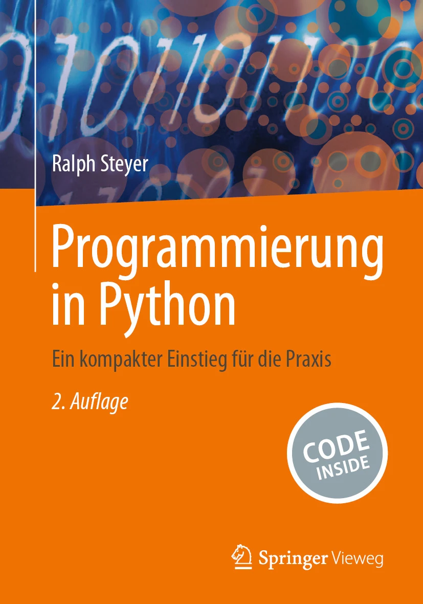

# Springer Nature Code Inside

Dieses GitHub-Repository ergänzt das Buch [*Programmierung in Python (2. Aufl.)*](https://doi.org/10.1007/978-3-658-44286-6) von Ralph Steyer (Springer Vieweg, 2024).

In diesem Repository stehen die Quelltexte zum Buch nach Kapiteln sortiert zur Verfügung.
